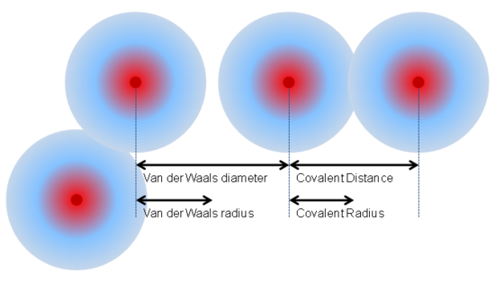

# DoublePendule_Physique
Projet Physique Computationel 2 HES-SO Valais-Wallis  
# Objectifs du projet
wiwiwi
## Matériel
compter
## Théorie

## Exercices
### 2 Différents types de molécules
#### Exercice 2.1 : Trouver les valeurs des attributs de la classe "Molecule" pour les molécules suivantes : $He, Ne, N2, O2$.
- REF `molecule.jl`
#### Exercice 2.2 : Quelles sont les différences entre ces molécules ? Est-ce que la théorie cinétique des gay fonctionne pour toutes ces molécules ?
Il y a différents types de gaz. Ici on a des gazs parfait, qui peuvent être simplifiés sous forme de sphères, tout en gardant une bonne précision.

Les autres gazs (non parfaits), ont des atomes qui s'embriquent les uns dans les autres, donc les simplifier sous forme de sphère parfaite, devient tout d'un coup moins précis que les gazs parfaits.

On va alors commencer cette simulation en partant du principe que toutes les molécules sont des sphères parfaites, et on developera la difficulté plus loins dans le projet.

Afin de prendre un rayon correcte pour les molécules imbriqués, nous allons utiliser le rayon covalent.

### 3 Le déplacement d'une molécule
Mainteneant que ous avez réussi à créer la classe "Molécule", vous allez mettre en mouvement celle-ci. Il est possible de simplifier sa dynamique sous la form d'un mouvement de projectile sans interaction avec son environnement.
#### Exercice 3.1 : En utilisant la seconde loi de Newton, écrivez les équations gouvernant le mouvement de ces molécules.
##### `Forces`
2ème Loi de Newton : $$F = m*a$$

Forces agissant sur une molécule :
- Gravité
- Liens entre les molécules ???
- Chaleur ??
- Rotation des électrons ?

##### `Energie`
- L'`énergie`: $$E = kT$$
(E = Energie, k = constante de Boltzmann, T = Température)

- L'`énergie cinétique` d'une molécule: $$\frac{1}{2} m <u²> = \frac{3}{2} k_B T.$$

#### Exercice 3.2 : Utilisez les différences finies sur le système d'équation obtenu à la question précédente.

#### Exercice 3.3 : Implémentez ce calcul dans la méthode $computeNextPosition$ calculant la position de la molécule au pas de temps d'après. POour cette méthode, il vous est fortement conseillé de mettre en argument l'instace de la molécule puis de changer sa position directement dans la fonction.
#### Exercice 3.4 :

# Simulation simples
haha
## Lois et formules
E = mc^2
## Résolution
tadaaa